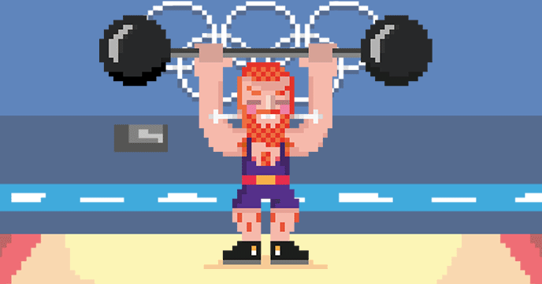

# Scratch Olympics Weightlifter

In this resource you will use Scratch to make a weightlifting game, which requires the player to either rapidly hit the keyboard or buttons to make the weightlifter compete.

[Resource testing feedback](https://docs.google.com/a/raspberrypi.org/forms/d/1M3SRyP-Bzoin-Wim8ZfupjFN1EwtQfqQCnuDE1G7LIU/viewform?entry.678098055=Scratch+Olympics+-+Weightlifter&entry.309275159&entry.594878714&entry.1804659587)

## Licence

Unless otherwise specified, everything in this repository is covered by the following licence:

***Scratch Olympics Weightlifter*** by the [Raspberry Pi Foundation](http://www.raspberrypi.org) is licenced under a [Creative Commons Attribution 4.0 International License](http://creativecommons.org/licenses/by-sa/4.0/).

Based on a work at https://github.com/raspberrypilearning/scratch-olympics-weightlifter
