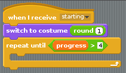
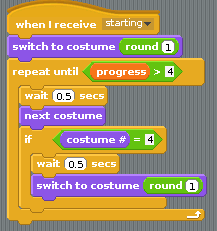
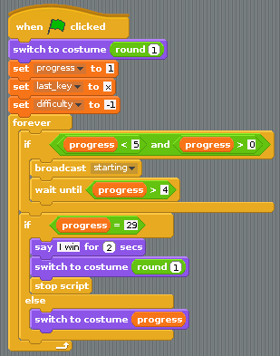

## Looping the animation

Let's make the game a little more interesting now. You can start off by using a little loop effect at the start of the game. Pay attention to this next part, as you'll be using the same techniques later on.

- The first four costumes can be looped to make the sprite look like he's getting ready to start. You'll need to get a `when I receive` block. Click on the little black arrow and create a new broadcast called `starting`:

    

- The first thing that happens in `starting` is a switch to the first costume. This broadcast block should then contain a `repeat until` block. You can make the code inside it run until the game begins. You'll know the game has begun because `progress` will increase above `1`. Use a `>` operator from **Operators** to help you build the script below:

    

- You can change the costume inside this loop. If the costume reaches number `4`, then it needs to be reset back to costume `1` again. You'll need a couple of `wait` blocks as well, so you can actually see the costume changing:

    
	
- If you click on this block, it should have a halo of white around it, and the sprite should start looping.

- To finish this section off, the `starting` block needs to be triggered from within the main script whenever `progress` is `1`, `2`, `3` or `4`. Another way of saying this is that `progress` is `< 5 and > 0`. If it is, then `starting` can be triggered and the script can wait until `progress` is greater than `4`. This all goes into the main script as shown below:

    

- Run your script and the weightlifter should glance left and right. When you start hitting the `x` and `z` keys then he should start to lift. If you stop hitting the keys, he'll return the weight to the floor and then start glancing left and right again.

