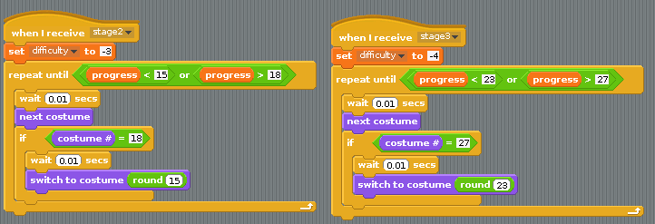
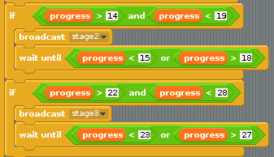
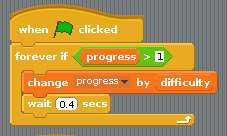
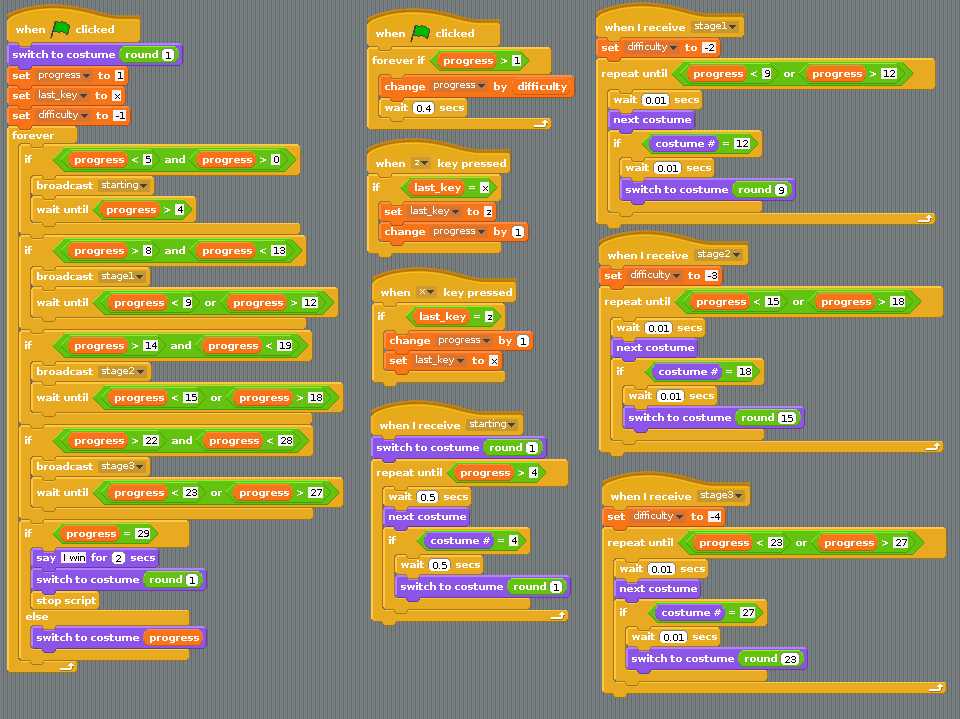

## More rolls

There are a few more opportunities to roll the animation. Costumes 15, 16, 17, and 18 can be looped, as can 23, 24, 25, 26, and 27.

- To do this, you can duplicate the scripts you have already used and just alter the values and broadcasts. Try and build the blocks below and then put the broadcasts into your main script:

    
	
	
	
- To test the script, you might want to alter the `wait` value which controls how quickly `progress` is decreased:

    

- If your scripts aren't working, have a look at the completed game below to make sure you haven't made any errors:

    
	
