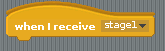
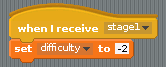
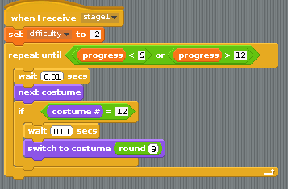
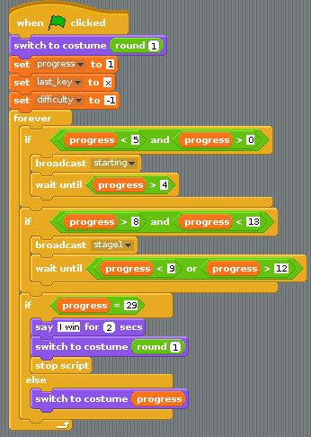
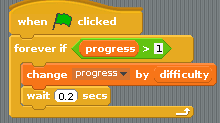

## Adding in a "strain" stage

- There are more sections that can be looped over. Create a new `when I receive` block and change it to `stage1`:

    

- When this is triggered, the game will get more difficult, so set `difficulty` to `-2`:

    
	
- This little script will be very similar to `starting`, except it will loop through costumes 9 to 12 and will stay working until `progress` is `< 9 or > 12`. Have a go at building the script shown below:

    
	
- This script can be triggered whenever `progress` is between 8 and 12 (`progress > 8 and progress < 13`). It should then wait until progress is no longer between 8 and 12 (`progress < 9 or progress > 12`):

    

- Test your script again to make sure that the animation rolls at the correct point. You might need to adjust the `wait` in the block below to a different number to test it properly:

    

