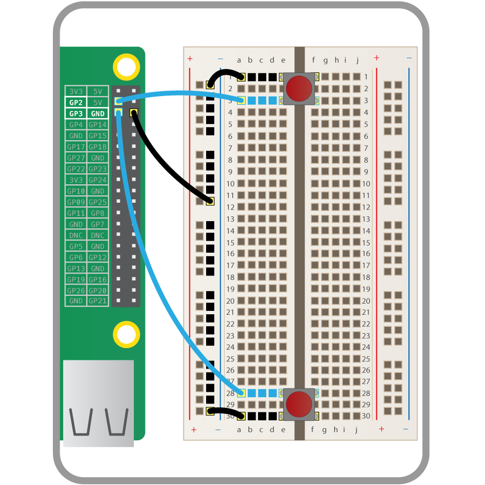

## Wiring up the buttons

The first step is to add two buttons to a breadboard. If you're using larger buttons, they can be wired directly to the pins. One button should be attached to **gpio2** and the other to **gpio3**. The breadboard needs to be grounded, and then each button wired into ground. The diagram below should help:

  
	
