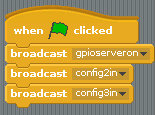
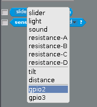

## Reading the buttons

- So that Scratch can detect button pushes, you need to make a few broadcasts to start with. This will start the *gpioserver* and also tell Scratch that the buttons are on **gpio2** and **gpio3**:

    
	
- Click the green flag to set up the pins.

- If you look in **Sensing** you should be able to click on the little arrow next to **slider** and see that `gpio2` and `gpio3` are now there.

    

