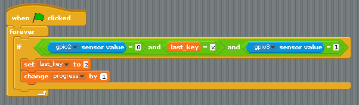
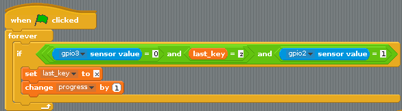

## Using the buttons

The logic for this next part is fairly complicated. You can use the same techniques as you did with the key presses, more or less.

- If the button on **gpio2** is pressed, its value drops to `0`. So if the sensor's values is 0 **and** the last key press was an `x` **and** the sensor for `gpio3` is 1, then `progress` can be increased:

    
	
- The script for the other button can then be duplicated and altered a little:

    

You might have to adjust the `wait` time for `progress` to be decreased, but have a go at your new game and see how well you do.

