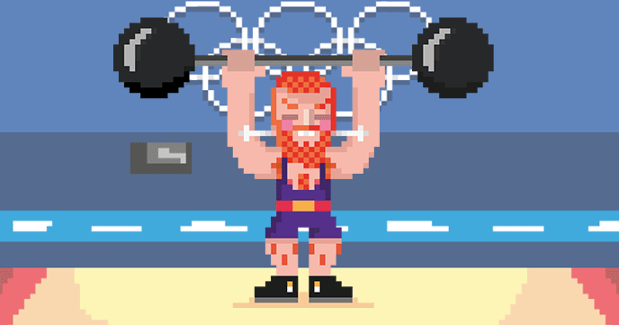

## The Scratch Olympics Weightlifter

In this activity, you will make a game in Scratch that allows you to test your keyboard-mashing skills. By repeatedly hitting the keyboard, the character will lift their barbell high into the air. There will also be the opportunity to have a play with some physical computing, and introduce some arcade-style buttons into the game.

