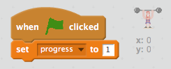
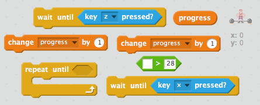
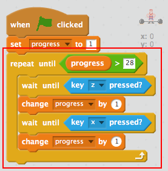
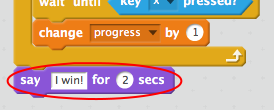
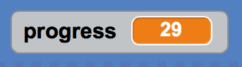

## Progressing through the lift

Let's start by using a variable to keep track of the weightlifter's progress.

+ Open the starter project

--- collapse ---
---
title: I'm using Scratch online
---

+ Open the 'Scratch Olympics Weightlifter' Scratch starter project at [jumpto.cc/weightlifter-go](http://jumpto.cc/weightlifter-go){:target="_blank"}.

+ If you have a Scratch account, you can click on **Remix** in the top right-hand corner to save a copy of the project to your account.

--- /collapse ---

--- collapse ---
---
title: I'm using Scratch offline
---

Download the [weightlifter.sb2](resources/weightlifter.sb2){:target="_blank"} Scratch starter project, and open it using the offline editor.

--- /collapse ---

+ Create a new variable called `progress` {.blockdata} that will be used to track progress through the lift.

[[[generic-scratch-add-variable]]]

+ Click on your __weightlifter__ sprite, and add code to set the `progress` {.blockdata} to 1 when the flag is clicked.

--- hints --- --- hint ---
When the __green flag__ is clicked, your `progress` {.blockdata} variable should be __set__ to 1.
--- /hint --- --- hint ---
Here is the code you will need:

--- /hint --- --- /hints ---

+ Add code to alternately press the `z` and `x` keys to increase the value of the `progress` {.blockata} variable until the progress gets above 28.

--- hints --- --- hint ---
Your weightlifter should __wait until__ the __ z key is pressed__, and then the `progress` {.blockdata} should __change__ by 1. Your weightlifter should __wait until__ the __ x key is pressed__, and then again __change__ the `progress` {.blockdata} by 1.

This should all be __repeated until__ the `progress` {.blockdata} is __greater than__ 28.
--- /hint --- --- hint ---
Here are the code blocks you'll need:

--- /hint --- --- hint ---
This is what your code should look like:

--- /hint --- --- /hints ---

+ Add a block to `say` {.blocklooks} "I win!" once the progress gets above 28.

+ Click the flag to test your code. Pressing `z` and `x` alternately should increase your progress from 1 to 29.

