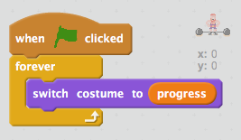

## Animating your weightlifter

Next you need to animate your weightlifter as he progresses through the lift.

+ Click on your weightlifter's __Costume__ tab and you should see 29 different costumes that will make up the animation.

This means that the costume can change as the progress increases.

+ Add code to your weightlifter to repeatedly show the costume with the same costume number as the progress.

For example, when the value of your `progress` {.blockdata} variable is 4, costume number 4 should be displayed.

--- hints --- --- hint ---
When the __green flag__ is clicked, your weightlifter should __switch costume__ to the costume number stored in your `progress` {.blockdata} variable __forever__.
--- /hint --- --- hint ---
Here are the code blocks you'll need:

--- /hint --- --- hint ---
This is what your code should look like:

--- /hint --- --- /hints ---

+ Test your code. As you press the `z` and `x` keys you should see the weightlifter move through the animation.

+ How fast can you press the keys to animate your weightlifter? What happens if you just hold down both the `z` and `x` keys?

Can you add code to fix this problem?

--- hints --- --- hint ---
Once the `z` key is pressed you should __wait until__ the z key is __not pressed__ before adding 1 to your progress {.blockdata} variable. You should also do the same after the `x` key is pressed.
--- /hint --- --- hint ---
Here are the code blocks you'll need:

--- /hint --- --- hint ---
This is what your code should look like:

--- /hint --- --- /hints ---

+ Test your new code again. What happens when you hold both keys down now?
