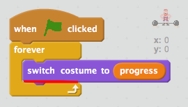
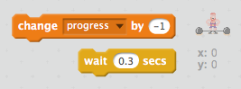
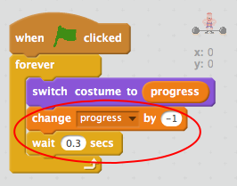
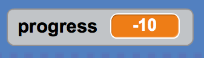
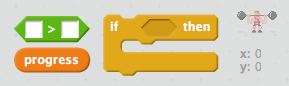
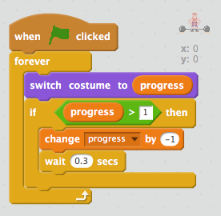
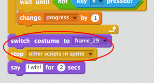

## Making the lift harder

At the moment your game is very easy! Let's make the `progress` go backwards if keys aren't being pressed!

+ Add code to your `forever` {.blockcontrol} loop to change the `progress` {.blockdata} by -1 every 0.3 seconds.

--- hints --- --- hint ---
You'll need to __change__ your `progress` {.blockdata} variable by -1, and then __wait__ for 0.3 seconds each time.
You'll need to add your code here:

--- /hint --- --- hint ---
Here are the code blocks you'll need:

--- /hint --- --- hint ---
This is what your code should look like:

--- /hint --- --- /hints ---

+ Test your code. Can you still lift the weight? You can change the number in your `wait` {.blockcontrol} block if you find the game too easy or too hard.

+ Have you noticed what happens if you don't press any buttons? Your `progress` {.blockdata} keeps going down into negative numbers.

+ Can you fix this bug by only changing the `progress` {.blockdata} if it is more than 1?

--- hints --- --- hint ---
You'll need to add code to only __change__ your `progress` {.blockdata} variable by -1 __if__ the `progress` {.blockdata} is __greater than__ (`>`) 1.
--- /hint --- --- hint ---
Here are the code blocks you'll need:

--- /hint --- --- hint ---
This is what your code should look like:

--- /hint --- --- /hints ---

+ Test your code again. Press some buttons and then stop. Does your animation stop at 1?

+ At the end of the lift, if you want to stop the animation going back to the start you can add this code:

