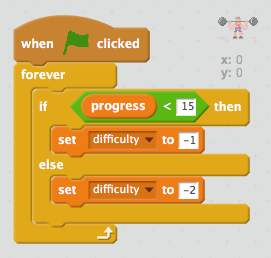

## Varying the difficulty

You can make the lift more difficult as it progresses.

+ Create a new variable called `difficulty` {.blockdata}.

+ Create a new script to set the `difficulty` {.blockdata} based on the current progress. This makes the second part of the lift twice as difficult as the first part.

+ Edit your code so that the progress is reduced by the number stored in your `difficulty` {.blockdata} variable.

+ Test your code. Does your game get harder once the progress reaches 15?
