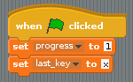
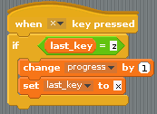
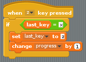

## Capturing the speed of key presses

The progress the weightlifter makes is going to be controlled by the speed at which the player can hit the `z` and `x` keys, so you need to create some scripts that will capture this data.

You're going to need two **variables** in this game. The first, called `progress`, will be used to record how far into the lift the weightlifter has managed to get. The second, called `last_key`, will be used to store the last key press the player made.

- Create these two variables by clicking in **Variables** and then clicking on **Make a variable**.
- Then you can start your script by setting `progress` to be `1` and `last_key` to be `x` when the game starts:

    

- The player must switch between hitting the `x` key and the `z` key for the `progress` to increase, so when the `x` key is pressed, your script needs to check that the last key press was `z`. If it was, then `progress` can be increased and the `last_key` can be switched to `x`. This is called **conditional selection**. The action only occurs `if` a variable is at the correct value:

    
	
- Of course, you want the same sort of thing to happen when you press the `z` key. You can duplicate the script by right-clicking on it and selecting **duplicate** from the context menu, then changing the duplicated script so it looks like the one below:

    

- Test that your game works by clicking on the green flag and then repeatedly hitting the `x` and `z` keys on the keyboard. You should see the variable `progress` increasing. The faster you hit the keys, the faster `progress` will increase.

