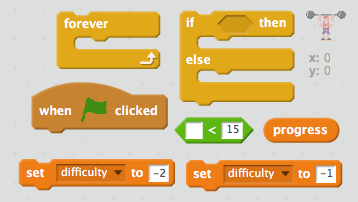
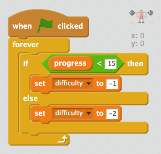
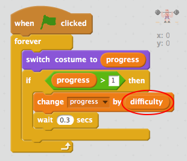

## Varying the difficulty

You can make the lift more difficult as it progresses.

+ Create a new variable called `difficulty` {.blockdata}.

+ Create a new script to set the `difficulty` {.blockdata} based on the current progress. If the `difficulty` {.blockdata} is less than 15 then set the difficulty to -1. Otherwise the `difficulty` {.blockdata} should be set to -2.

--- hints --- --- hint ---
When the __green flag__ is clicked, __if__ the `progress` {.blockdata} is less than 15 then the `difficulty` {.blockdata} should be __set__ to -1. Otherwise (__else__) the `difficulty` {.blockdata} should be __set__ to -2. This check should happen __forever__.
--- /hint --- --- hint ---
Here are the code blocks you'll need:

--- /hint --- --- hint ---
This is what your code should look like:

--- /hint --- --- /hints ---

+ Edit your code so that the progress is reduced by the number stored in your `difficulty` {.blockdata} variable.

+ Test your code. Does your game get harder once the progress reaches 15?
