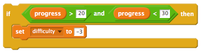

--- challenge ---

## Challenge: Testing the difficulty

Ask someone else to play your game. Did they find it too hard or too easy? Change your code so that your game is just the right difficulty. You could:

    Make the `progress` {.blockdata} reduce faster or slower.
    Set the `difficulty` {.blockdata} higher or lower.

You could even create more than one 'stage', by making the `difficulty` {.blockdata} increase more than once. Here are some code blocks that might help you:

--- /challenge ---
