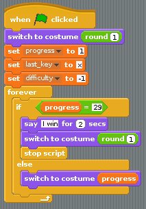
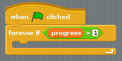
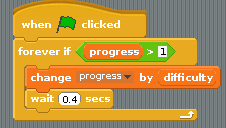
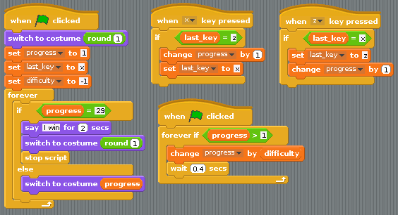

## Making it a little trickier

- If you stop hitting the `x` and `z` keys, then the weightlifter just stops lifting. It would be good if he started to put the weight back down if the player's speed on the keyboard decreases. This can be done by decreasing the value of `progress` every once in a while. To start with, create a new variable and call it `difficulty`. This can be set to -1 in the main script:

    
	
- Grab a new `when green flag clicked` block and place it into the Scripts area. You can now use a `forever if` loop, which will run as long as a variable is at a certain value. You want it to run as long as `progress` is greater than `1`:

    

- Inside the `forever if` loop, you'll need to keep changing `progress` by the value of `difficulty`. As difficulty is a negative number, this will keep reducing progress until it reaches 1. You'll need to use a little `wait` command as well, since computers are so fast there's no way a player could keep up with the computer otherwise. Waiting for `0.4` seconds will do to start with:
    
	

- Test your game to see the weightlifter pick up the weight as you hit the keys, but lower it again if you stop pressing them.

- If it's not working, have a look at the scripts below and make sure yours are the same:

    

