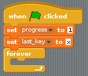
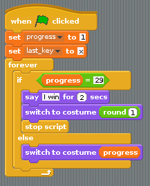

## Making the character lift

- There are a total of 29 costumes in the game. The sprite's costume can be continually set so that it's the same as the `progress` variable. That way, as `progress` increases, the costume will change. When `progress` reaches `29`, the game can end.

- You will need a `forever` loop for the main logic of the game. Find a `forever` loop in the **Control** section and add it to the bottom of your main script:

    

- Now place another conditional block within the `forever` loop; this time, you can use an `if else` block. If `progress` reaches `29` then the sprite can `say "I win"`, the costume can be set back to costume 1, and the script can be stopped. If `29` has not yet been reached, then the costume can be set to the same value as `progress`.
- You can't actually set a costume to a specific number in Scratch, but you can use the `round` operator from **Operators** to set the costume to a specific number:

    
	
- Have a go at testing your script. Click the green flag and then start hitting the `x` and `z` keys alternately to watch the weightlifter go.
- It's a good idea to reset the costume back to number 1 each time the script starts:

    

