# The Scratch Olympics Weightlifter

In this activity, you will make a game in Scratch that allows you to test your keyboard-mashing skills. By repeatedly hitting the keyboard, the character will lift their barbell high into the air. There will also be the opportunity to have a play with some physical computing, and introduce some arcade-style buttons into the game.

## Getting the game assets

For this project, you're going to need a sprite and a background. You can download a zip file containing all the game assets by clicking [here](images/scratch_olympics_weightlifter.zip) and choosing to download the file. 

Once the file has been downloaded, you can unzip the archive by right-clicking on it and choosing `unzip`.

You should see two directories: one containing the weightlifter's costumes and the other containing the background.

## Importing the assets into Scratch

Open Scratch by clicking `Menu` > `Programming` > `Scratch`.

Now click on the **Stage** icon and then drag and drop the Olympics background into the **Backgrounds** tab. You can delete the original background.

Next, click on **Sprite1** and then, one by one, drag and drop the Weightlifter costumes into the **Costumes** tab. You can delete the original costumes.

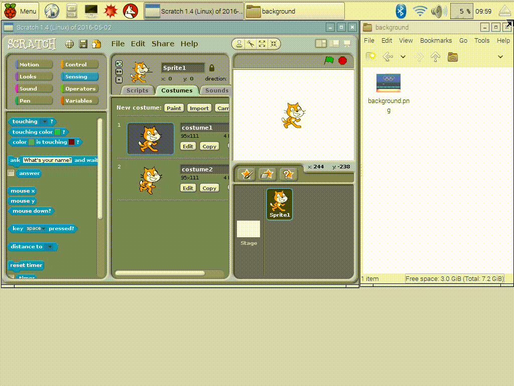

## Testing the animation

You can check whether the animation will work using the simple script shown below:

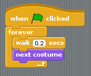

Click on the green flag and watch the weightlifter do his thing!

## Capturing the speed of key presses

The progress the weightlifter makes is going to be controlled by the speed at which the player can hit the `z` and `x` keys, so you need to create some scripts that will capture this data.

You're going to need two **variables** in this game. The first, called `progress`, will be used to record how far into the lift the weightlifter has managed to get. The second, called `last_key`, will be used to store the last key press the player made.

1. Create these two variables by clicking in **Variables** and then clicking on **Make a variable**.
1. Then you can start your script by setting `progress` to be `1` and `last_key` to be `x` when the game starts:

    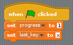

1. The player must switch between hitting the `x` key and the `z` key for the `progress` to increase, so when the `x` key is pressed, your script needs to check that the last key press was `z`. If it was, then `progress` can be increased and the `last_key` can be switched to `x`. This is called **conditional selection**. The action only occurs `if` a variable is at the correct value:

    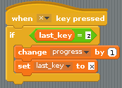
	
1. Of course, you want the same sort of thing to happen when you press the `z` key. You can duplicate the script by right-clicking on it and selecting **duplicate** from the context menu, then changing the duplicated script so it looks like the one below:

    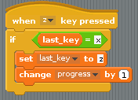

1. Test that your game works by clicking on the green flag and then repeatedly hitting the `x` and `z` keys on the keyboard. You should see the variable `progress` increasing. The faster you hit the keys, the faster `progress` will increase.

## Making the character lift

1. There are a total of 29 costumes in the game. The sprite's costume can be continually set so that it's the same as the `progress` variable. That way, as `progress` increases, the costume will change. When `progress` reaches `29`, the game can end.

1. You will need a `forever` loop for the main logic of the game. Find a `forever` loop in the **Control** section and add it to the bottom of your main script:

    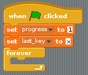

1. Now place another conditional block within the `forever` loop; this time, you can use an `if else` block. If `progress` reaches `29` then the sprite can `say "I win"`, the costume can be set back to costume 1, and the script can be stopped. If `29` has not yet been reached, then the costume can be set to the same value as `progress`.
1. You can't actually set a costume to a specific number in Scratch, but you can use the `round` operator from **Operators** to set the costume to a specific number:

    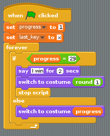
	
1. Have a go at testing your script. Click the green flag and then start hitting the `x` and `z` keys alternately to watch the weightlifter go.
1. It's a good idea to reset the costume back to number 1 each time the script starts:

    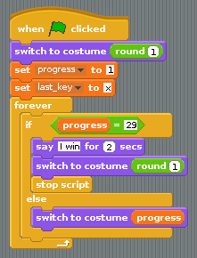

## Making it a little trickier

1. If you stop hitting the `x` and `z` keys, then the weightlifter just stops lifting. It would be good if he started to put the weight back down if the player's speed on the keyboard decreases. This can be done by decreasing the value of `progress` every once in a while. To start with, create a new variable and call it `difficulty`. This can be set to -1 in the main script:

    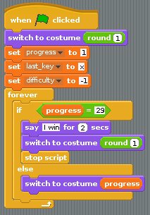
	
1. Grab a new `when green flag clicked` block and place it into the Scripts area. You can now use a `forever if` loop, which will run as long as a variable is at a certain value. You want it to run as long as `progress` is greater than `1`:

    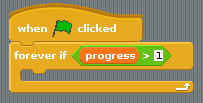

1. Inside the `forever if` loop, you'll need to keep changing `progress` by the value of `difficulty`. As difficulty is a negative number, this will keep reducing progress until it reaches 1. You'll need to use a little `wait` command as well, since computers are so fast there's no way a player could keep up with the computer otherwise. Waiting for `0.4` seconds will do to start with:
    
	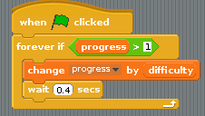

1. Test your game to see the weightlifter pick up the weight as you hit the keys, but lower it again if you stop pressing them.

1. If it's not working, have a look at the scripts below and make sure yours are the same:

    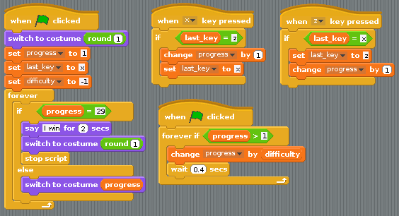

## Looping the animation

Let's make the game a little more interesting now. You can start off by using a little loop effect at the start of the game. Pay attention to this next part, as you'll be using the same techniques later on.

1. The first four costumes can be looped to make the sprite look like he's getting ready to start. You'll need to get a `when I receive` block. Click on the little black arrow and create a new broadcast called `starting`:

    

1. The first thing that happens in `starting` is a switch to the first costume. This broadcast block should then contain a `repeat until` block. You can make the code inside it run until the game begins. You'll know the game has begun because `progress` will increase above `1`. Use a `>` operator from **Operators** to help you build the script below:

    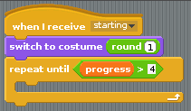

1. You can change the costume inside this loop. If the costume reaches number `4`, then it needs to be reset back to costume `1` again. You'll need a couple of `wait` blocks as well, so you can actually see the costume changing:

    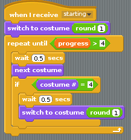
	
1. If you click on this block, it should have a halo of white around it, and the sprite should start looping.

1. To finish this section off, the `starting` block needs to be triggered from within the main script whenever `progress` is `1`, `2`, `3` or `4`. Another way of saying this is that `progress` is `< 5 and > 0`. If it is, then `starting` can be triggered and the script can wait until `progress` is greater than `4`. This all goes into the main script as shown below:

    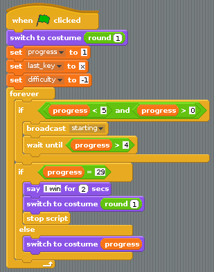

1. Run your script and the weightlifter should glance left and right. When you start hitting the `x` and `z` keys then he should start to lift. If you stop hitting the keys, he'll return the weight to the floor and then start glancing left and right again.

## Adding in a "strain" stage

1. There are more sections that can be looped over. Create a new `when I receive` block and change it to `stage1`:

    

1. When this is triggered, the game will get more difficult, so set `difficulty` to `-2`:

    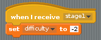
	
1. This little script will be very similar to `starting`, except it will loop through costumes 9 to 12 and will stay working as long as `progress` is `< 9 or > 12`. Have a go at building the script shown below:

    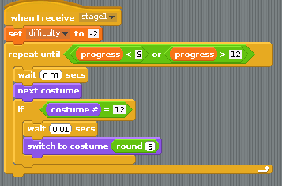
	
1. This script can be triggered whenever `progress` is between 8 and 12 (`progress > 8 and progress < 13`). It should then wait until progress is no longer between 8 and 12 (`progress < 9 or progress > 12`):

    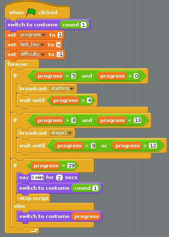

1. Test your script again to make sure that the animation rolls at the correct point. You might need to adjust the `wait` in the block below to a different number to test it properly:

    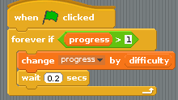

## More rolls

There are a few more opportunities to roll the animation. Costumes 15, 16, 17, and 18 can be looped, as can 23, 24, 25, 26, and 27.

1. To do this, you can duplicate the scripts you have already used and just alter the values and broadcasts. Try and build the blocks below and then put the broadcasts into your main script:

    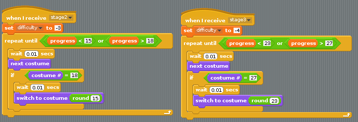
	
	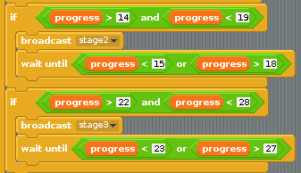
	
1. To test the script, you might want to alter the `wait` value which controls how quickly `progress` is decreased:

    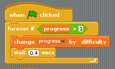

1. If your scripts aren't working, have a look at the completed game below to make sure you haven't made any errors:

    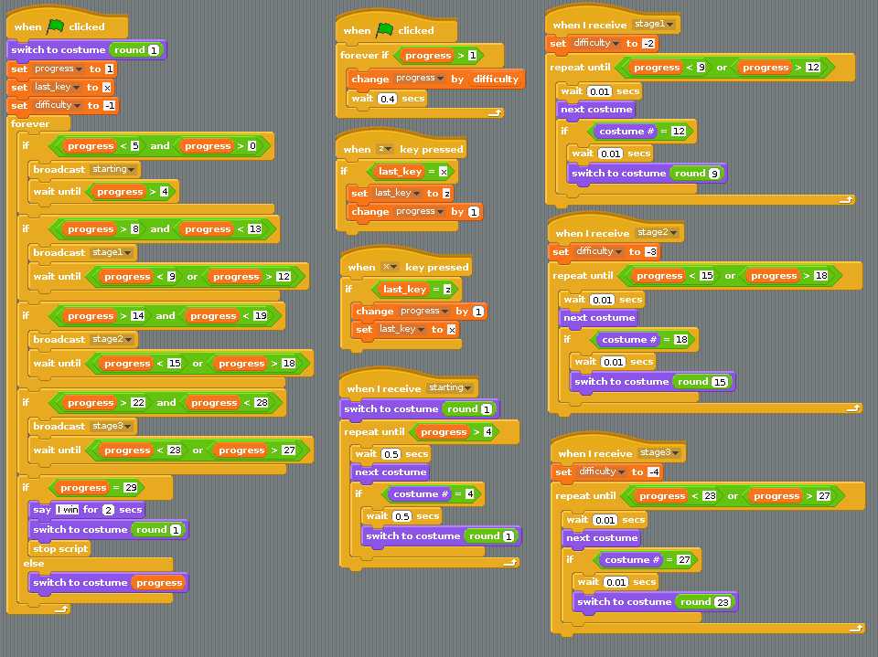
	
## What next?

- Why not have a go at [worksheet 2](worksheet2.md) and use some physical buttons to control the weightlifter instead of the keyboard?

