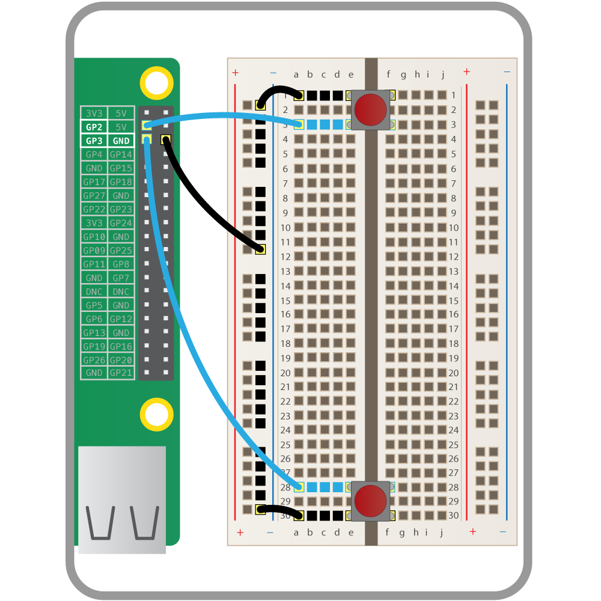
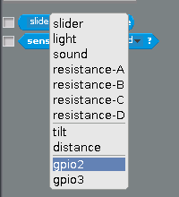
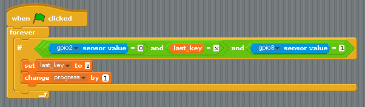
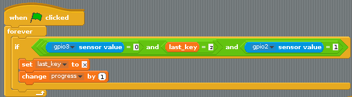

# Scratch Olympics Weightlifter

[back to worksheet 1](worksheet.md)

In this section, you're going to use some physical buttons to control the weightlifter instead of the keyboard.

## Wiring up the buttons

The first step is to add two buttons to a breadboard. If you're using larger buttons, they can be wired directly to the pins. One button should be attached to **gpio2** and the other to **gpio3**. The breadboard needs to be grounded, and then each button wired into ground. The diagram below should help:

    
	
## Reading the buttons

1. So that Scratch can detect button pushes, you need to make a few broadcasts to start with. This will start the *gpioserver* and also tell Scratch that the buttons are on **gpio2** and **gpio3**:

    
	
1. Click the green flag to set up the pins.

1. If you look in **Sensing** you should be able to click on the little arrow next to **slider** and see that `gpio2` and `gpio3` are now there.

    

## Using the buttons

The logic for this next part is fairly complicated. You can use the same techniques as you did with the key presses, more or less.

1. If the button on **gpio2** is pressed, its value drops to `0`. So if the sensor's values is 0 **and** the last key press was an `x` **and** the sensor for `gpio3` is 1, then `progress` can be increased:

    
	
1. The script for the other button can then be duplicated and altered a little:

    

You might have to adjust the `wait` time for `progress` to be decreased, but have a go at your new game and see how well you do.

## What next?

- Have a look at [Physical Computing in Scratch](https://www.raspberrypi.org/learning/physical-computing-with-scratch/). What other components could you use?
- Why not try and add in a high score table, so you can compete with your friends?
